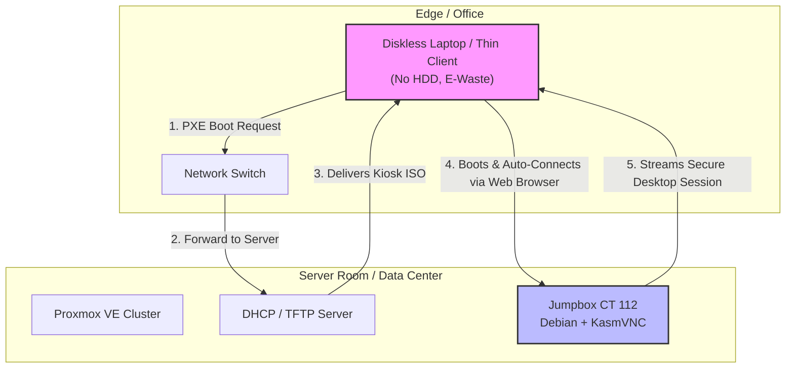

# Jumpbox Kiosk Architecture

Welcome to the **Jumpbox Kiosk** project. This repository details a robust, open-source stateless computing architecture designed specifically to empower businesses in developing nations, such as Papua New Guinea. By transforming e-waste into highly functional terminals, this architecture slashes IT costs, eliminates local points of failure, and centralizes management.

## 🌍 Developing Nations Context

Operating an IT infrastructure in emerging economies presents unique environmental and infrastructural challenges. This architecture is built from the ground up to address:

### Hardware Longevity (Heat & Humidity)
Tropical climates with extreme heat and high humidity relentlessly degrade mechanical components. Traditional hard disk drives (HDDs) have abysmal lifespans in these environments. By removing local storage entirely, we eliminate the primary point of hardware failure.

### Power Instability (Blackouts & Brownouts)
Unpredictable power grids cause sudden shutdowns that frequently corrupt standard PC operating systems and file systems. Since our kiosks are entirely stateless and run solely in memory (RAM), a sudden loss of power causes **zero data corruption**. Simply turn the device back on, and it boots fresh over the network.

### Bandwidth Limitations (Satellite Data)
In regions reliant on expensive, metered, or high-latency internet connections (like satellite), downloading updates or data to individual PCs is cost-prohibitive. Centralized processing means all heavy lifting and internet traffic happens on the server side. The kiosk only receives compressed screen updates, drastically reducing wide-area network bandwidth consumption.

## 💻 Hardware Specs: The Power of E-Waste

Why buy expensive modern PCs when old hardware performs just as well in a stateless setup? This architecture thrives on **E-Waste recovery**.

* **Kiosk Terminals:** 10 to 15-year-old laptops, $30 thin clients, or any legacy x86 hardware.
* **Storage Requirements:** **None.** These machines operate completely diskless. Hard drives are removed entirely.
* **Boot Method:** Network boot (PXE). The terminals fetch a lightweight custom Debian Kiosk ISO directly from the server on startup.

## 💰 Financial Impact & Risks

### Massive Cost Savings
* **Zero Licensing Fees:** No Microsoft Windows licenses, no expensive enterprise Antivirus software, and no per-user client access licenses.
* **Zero Storage Costs at the Edge:** Without the need for HDDs or SSDs in client machines, hardware procurement and replacement costs plummet.
* **Reduced Maintenance:** Centralized management means IT staff spend zero time fixing individual client operating systems.

### Risks & Mitigation: Single Point of Failure (SPOF)
The primary risk of a centralized architecture is that if the main server goes down, the client terminals cannot operate. 
**Mitigation:** We utilize **Proxmox High Availability (Clustering)**. By deploying two inexpensive, redundant commodity servers in a cluster, the system can automatically migrate and restart the jumpbox services if one server experiences a hardware failure. This ensures maximum uptime with minimal investment.

## 🏗️ Architecture Overview

The stateless architecture relies on PXE booting diskless clients to a Proxmox environment hosting KasmVNC jumpboxes.

## 📖 Deep Technical Implementation

This document serves as the high-level business case. For detailed, step-by-step instructions on implementing this architecture, please refer to the technical markdown files in this repository:
- Project Goal & PXE Boot Setup
- Troubleshooting (Porteus drivers, STP switch delays, Nginx 502s, KasmVNC auth)
- Custom Debian Kiosk ISO Build Guide
- Proxmox Jumpbox (CT 112) Configuration with KasmVNC
