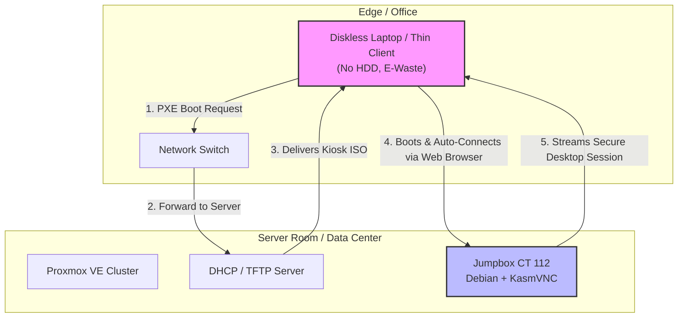

# Jumpbox Kiosk Architecture

Welcome to the **Jumpbox Kiosk** project. This repository details a robust, open-source stateless computing architecture designed specifically to empower businesses in developing nations, such as Papua New Guinea. By transforming e-waste into highly functional terminals, this architecture slashes IT costs, eliminates local points of failure, and centralizes management.

## 🌍 Developing Nations Context: Challenges & Mitigations

Operating an IT infrastructure in emerging economies presents unique environmental and infrastructural challenges. This architecture is built from the ground up to address them:

| Challenge | Impact on Traditional PCs | The Stateless Kiosk Mitigation |
| :--- | :--- | :--- |
| **Heat & Humidity** | Relentlessly degrades mechanical parts, leading to massive hard drive (HDD) failure rates. | **100% Diskless endpoints.** Laptops have no HDDs or SSDs, eliminating the primary point of hardware failure. |
| **Power Instability** | Unpredictable blackouts cause sudden shutdowns that corrupt standard operating systems. | **Zero Data Corruption.** Endpoints run entirely in RAM. If power drops, nothing corrupts. Just turn it back on. |
| **Bandwidth (Satellite)** | Downloading Windows updates to 50 individual PCs consumes expensive, metered bandwidth. | **Centralized Processing.** Updates happen once on the server. Endpoints just stream screen pixels, slashing WAN usage. |

## 💻 Hardware Requirements & Sizing

### 1. The Diskless Endpoints (E-Waste Recovery)
Why buy expensive modern PCs when old hardware performs just as well? This architecture thrives on **E-Waste recovery**.
* **Kiosk Terminals:** 10 to 15-year-old laptops, $30 thin clients, or any legacy x86 hardware.
* **Storage Requirements:** **None.** These machines operate completely diskless. 
* **Boot Method:** Network boot (PXE). **Note: You do not need multiple ISOs!** The exact same 830MB lightweight Debian ISO is infinitely reusable and streamed to every client simultaneously from the PXE server.

### 2. The Centralized Server (Compute Power)
Because the terminals do zero processing, your server requires enough compute power to host the desktop sessions (via KasmVNC/LXC containers). Here is a scaling guide for your Proxmox host:

| Workload Type | Example Tasks | RAM per User | vCPU per User |
| :--- | :--- | :--- | :--- |
| **Light Workload** | Data entry, basic web apps, internal dashboards | 1 - 2 GB | 1 vCPU |
| **Heavy Workload** | Media streaming, heavy JavaScript/React web apps | 3 - 4 GB | 2 vCPUs |

*(Example: Hosting 20 Light Workload data-entry staff requires ~30GB RAM and 20 vCPUs on the central server).*

## 💰 Financial Impact & Cost Savings

* **The "One UPS" Rule:** Buying 50 Uninterruptible Power Supplies (UPS) for 50 desks is wildly expensive. With this architecture, you only need **one high-quality UPS** for the server room. If the office power dies, the client monitors go black—but the desktop sessions remain actively running on the server! When the power returns, users boot up and are instantly reconnected to their session exactly where they left off.
* **Zero Licensing Fees:** No Microsoft Windows licenses, no expensive enterprise Antivirus software, and no per-user client access licenses.
* **Zero Storage Costs at the Edge:** Without the need for HDDs or SSDs in client machines, hardware procurement and replacement costs plummet.

### Risks & Mitigation: Single Point of Failure (SPOF)
The primary risk of a centralized architecture is that if the main server goes down, the client terminals cannot operate. 
**Mitigation:** We utilize **Proxmox High Availability (Clustering)**. By deploying two inexpensive, redundant commodity servers in a cluster, the system can automatically migrate and restart the jumpbox services if one server experiences a hardware failure. This ensures maximum uptime with minimal investment.

## 🏗️ Architecture Overview

The stateless architecture relies on PXE booting diskless clients to a Proxmox environment hosting KasmVNC jumpboxes.

## 📖 Deep Technical Implementation

This document serves as the high-level business case. For detailed, step-by-step instructions on implementing this architecture, please refer to the technical markdown files in this repository:
- Project Goal & PXE Boot Setup
- Troubleshooting (Porteus drivers, STP switch delays, Nginx 502s, KasmVNC auth)
- Custom Debian Kiosk ISO Build Guide
- Proxmox Jumpbox (CT 112) Configuration with KasmVNC
